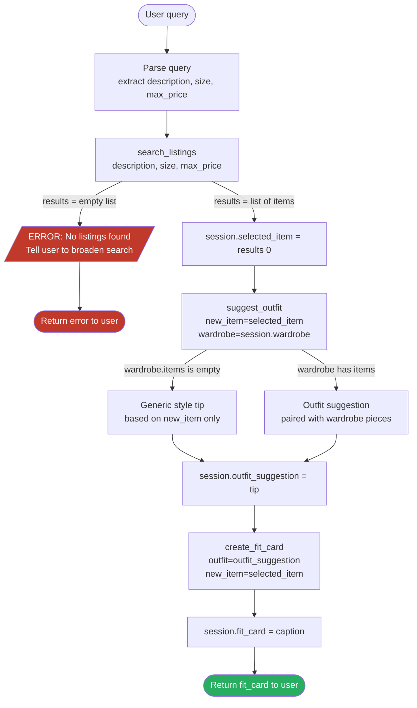

# FitFindr - planning.md

<!-- > Complete this document before writing any implementation code.
> Your spec and agent diagram are what you'll use to direct AI tools (Claude, Copilot, etc.) to generate your implementation - the more specific they are, the more useful the generated code will be.
> Your planning.md will be reviewed as part of your submission.
> Update it before starting any stretch features. -->

---

## Tools

<!-- List every tool your agent will use. For each tool, fill in all four fields.
You must have at least 3 tools. The three required tools are listed - add any additional tools below them. -->

### Tool 1: search_listings

**What it does:**
Filters the mock listings dataset against the user's query and constraints, returning a ranked list of matching secondhand items. It scores each listing by how well its title, description, style_tags, and category match the query text, then applies hard filters for size and max_price.

**Input parameters:**
- `description` (str): Free-text query describing the item the user wants (e.g. "vintage graphic tee"). Matched against title, description, category, and style_tags fields.
- `size` (str): The user's size (e.g. "M", "W30 L30"). Filters out listings whose `size` field does not match. Optional - if omitted or empty, size is not filtered.
- `max_price` (float): Upper price limit in dollars (inclusive). Filters out listings whose `price` exceeds this value. Optional - if omitted, no price cap is applied.

**Function signature and matching rules:**
- `def search_listings(description: str, size: Optional[str] = None, max_price: Optional[float] = None) -> List[Dict[str, Any]]`
- Size matching: normalize sizes to uppercase and trim whitespace. Match by exact token equality (e.g. `M` == `M`) but allow common variants (`W30` matches `30` if numeric-only comparison is implemented). Document any relaxations in the implementation.
- Scoring: use a deterministic weighted score (title: 0.5, description: 0.3, style_tags: 0.15, category: 0.05). Break ties by lower `price` then higher `condition` (excellent > good > fair).

**What it returns:**
A list of up to 3 matching listing dictionaries, sorted by relevance score (descending). Each dict contains: `id` (str), `title` (str), `description` (str), `category` (str), `style_tags` (list[str]), `size` (str), `condition` (str: excellent/good/fair), `price` (float), `colors` (list[str]), `brand` (str or None), `platform` (str: depop/thredUp/poshmark). Returns an empty list `[]` if no listings match.

**What happens if it fails or returns nothing:**
If the returned list is empty, the agent responds to the user with a message explaining why nothing was found and suggests adjustments - e.g. "No listings matched your search. Try broadening your description, raising your budget, or leaving the size field blank." The agent then stops and does NOT call `suggest_outfit`.

---

### Tool 2: suggest_outfit

**What it does:**
Given a newly found thrift item and the user's existing wardrobe, generates a natural-language outfit suggestion explaining how to style the new item with pieces the user already owns. It considers color compatibility, style_tags, and category balance (top + bottom + shoes + optional outerwear).

**Input parameters:**
- `new_item` (dict): The listing dict selected from `search_listings` results (the top result, i.e. `results[0]`). Must include at least `title`, `colors`, `style_tags`, and `category`.
- `wardrobe` (dict): A wardrobe dict with an `items` key containing a list of wardrobe item dicts. Each wardrobe item has: `id` (str), `name` (str), `category` (str), `colors` (list[str]), `style_tags` (list[str]), `notes` (str or None). Use `get_example_wardrobe()` for a real user or `get_empty_wardrobe()` for a new user.

**Function signature and output constraints:**
- `def suggest_outfit(new_item: Dict[str, Any], wardrobe: Dict[str, Any]) -> str`
- Output: 2–4 sentences. If `wardrobe['items']` is empty, return a generic styling tip (1–2 sentences).

**What it returns:**
A 2–4 sentence outfit suggestion describing which wardrobe pieces to pair with the new item and how to wear them together (e.g. "Pair this tee with your baggy dark-wash jeans and chunky white sneakers. Throw your black denim jacket over it for an easy layered look.").

**What happens if it fails or returns nothing:**
If `wardrobe['items']` is empty, the agent skips the pairing suggestions and returns a generic styling tip based solely on the new item's style_tags and colors (e.g. "This piece works great with high-waisted denim and white sneakers."). If the new_item dict is missing required fields, the agent notes "Could not generate a full outfit suggestion" and passes whatever it has to `create_fit_card`.

---

### Tool 3: create_fit_card

**What it does:**
Produces a short, social-media-style caption summarizing the complete outfit - the thrifted find, where it came from, the price, and how it fits the overall look. This is the final artifact returned to the user.

**Input parameters:**
- `outfit` (str): The outfit suggestion string returned by `suggest_outfit`.
- `new_item` (dict): The listing dict for the thrifted piece, used to pull `title`, `price`, `platform`, and `condition` for the caption.

**Function signature and output constraints:**
- `def create_fit_card(outfit: str, new_item: Dict[str, Any]) -> str`
- Output: 2–4 sentence social caption. When available, the caption must include `platform` and `price` (e.g., "off depop for $18"). If those fields are missing, fall back to a minimal caption that uses whatever is available.

**What it returns:**
A 2–4 sentence fit card caption in a casual, first-person Instagram-style voice. Example: "thrifted this faded band tee off depop for $22 and honestly it was made for my wide-legs 🖤 full look in my stories."

**What happens if it fails or returns nothing:**
If `outfit` is an empty string or `new_item` is missing key fields (`title`, `price`, `platform`), the agent returns a minimal fallback caption using only whatever data is available (e.g. "Found a great piece on [platform] - styled and ready to wear.") rather than failing silently.

---

### Additional Tools (if any)

<!-- Copy the block above for any tools beyond the required three -->

## Listing schema

For clarity, listings in `data/listings.json` include these fields (all returned by `search_listings`):
- `id` (str)
- `title` (str)
- `description` (str)
- `category` (str)
- `style_tags` (list[str])
- `size` (str)
- `condition` (str: excellent|good|fair)
- `price` (float)
- `colors` (list[str])
- `brand` (str or null)
- `platform` (str: depop|thredUp|poshmark)


---

## Planning Loop

**How does your agent decide which tool to call next?**

The planning loop runs sequentially with early-exit on failure:

1. Parse the user's message to extract `description`, `size` (if mentioned), and `max_price` (if a budget is mentioned). Call `search_listings(description, size, max_price)`.
2. Check if `results` is an empty list. If yes: set an error message in the session ("No listings found - try a broader search or higher budget"), return it to the user, and stop. Do not proceed.
3. If `results` is non-empty: set `session.selected_item = results[0]`. Call `suggest_outfit(new_item=session.selected_item, wardrobe=session.wardrobe)`.
4. Store the returned string as `session.outfit_suggestion`. Call `create_fit_card(outfit=session.outfit_suggestion, new_item=session.selected_item)`.
5. Store the returned string as `session.fit_card`. Return `session.fit_card` (and optionally `session.outfit_suggestion`) to the user. Done.

The loop knows it is done when `create_fit_card` returns successfully, or when an early-exit error path is triggered after `search_listings`.

---

## State Management

**How does information from one tool get passed to the next?**

Within a single session turn, the agent maintains a session dict with the following keys:

- `session.wardrobe` - set at the start of the session from `get_example_wardrobe()` (or `get_empty_wardrobe()` for a new user with no items). Passed as-is to `suggest_outfit`.
- `session.selected_item` - set after `search_listings` returns; holds `results[0]`. Passed as `new_item` to both `suggest_outfit` and `create_fit_card`.
- `session.outfit_suggestion` - set after `suggest_outfit` returns its string. Passed as `outfit` to `create_fit_card`.
- `session.fit_card` - set after `create_fit_card` returns. This is the final string shown to the user.
- `session.error` - set if any tool hits a failure path. Causes the loop to skip remaining steps and return the error message.

Each tool only reads keys that were set by a prior step, so state flows strictly forward and there is no circular dependency.

---

## Error Handling

For each tool, describe the specific failure mode you're handling and what the agent does in response.

| Tool | Failure mode | Agent response |
|------|-------------|----------------|
| search_listings | No results match the query | Agent tells the user: "No listings matched '[query]' under $[price] in size [size]. Try a broader description, a higher budget, or remove the size filter." Stops and does not call suggest_outfit. |
| suggest_outfit | Wardrobe is empty (`items` list is `[]`) | Agent generates a generic style tip based only on the new item's style_tags and colors, without referencing any wardrobe pieces. Still calls create_fit_card with this tip. |
| create_fit_card | Outfit string is empty or new_item missing `title`/`price`/`platform` | Agent returns a minimal fallback caption: "Found [title or 'a great piece'] on [platform or 'a thrift platform'] - styled and ready to wear." Never fails silently. |
| Any tool | File read / JSON parse / runtime exception (e.g., `load_listings()` fails) | Tools should return a safe failure value (for `search_listings` this is an empty list `[]`) and log the internal error. The agent is responsible for detecting tool-level failures (e.g., `results == []` from `search_listings` when a data load error occurred) and converting them into a friendly user-facing message such as: "Sorry, there was an internal data error, please try again later." Do not expose internal tracebacks to users. |

---

## Architecture



State / Session keys: `wardrobe`, `selected_item`, `outfit_suggestion`, `fit_card`, `error`

---

## AI Tool Plan

**Milestone 3 - Individual tool implementations:**

- **search_listings**: I'll give Claude the Tool 1 spec block from this file (inputs, return value, failure mode) plus the `load_listings()` docstring from `utils/data_loader.py`. I'll ask it to implement `search_listings(description, size, max_price)` that uses `load_listings()` and filters/scores listings by matching the description against `title`, `description`, `style_tags`, and `category`, then hard-filters by `size` and `max_price`. I'll verify by running 3 test queries: one that should return results, one that should return empty (very restrictive), and one with no size filter.

- **suggest_outfit**: I'll give Claude the Tool 2 spec block plus the wardrobe schema from `data/wardrobe_schema.json`. I'll ask it to implement `suggest_outfit(new_item, wardrobe)` that produces a 2–4 sentence pairing suggestion, with a fallback for empty wardrobes. I'll verify by calling it with the example wardrobe and a sample listing, and separately with `get_empty_wardrobe()` to confirm the fallback path triggers.

- **create_fit_card**: I'll give Claude the Tool 3 spec block and ask it to implement `create_fit_card(outfit, new_item)` producing a casual caption using `title`, `price`, `platform`, and the outfit string. I'll verify by passing a known outfit suggestion and listing dict and checking the output reads naturally and includes the price and platform.

### Acceptance tests (to run after implementation)

1. Normal query: `"vintage graphic tee", size="M", max_price=30.0` → `search_listings` returns non-empty, `suggest_outfit` runs, `create_fit_card` returns caption containing platform and price.
2. Empty-results query: extremely restrictive filters (e.g., `max_price=0.01`) → `search_listings` returns `[]`, agent returns user-facing error and does NOT call `suggest_outfit` or `create_fit_card`.
3. Empty-wardrobe path: use `get_empty_wardrobe()` and a valid listing → `suggest_outfit` returns a generic tip and `create_fit_card` returns a caption (no crash).

**How to run these checks locally:**

A verification script `verify.py` is included in the project root. It runs all three acceptance tests against the real Groq API and prints `[PASS]`/`[FAIL]` per assertion with a short preview of each tool's output.

Requirements: a valid `GROQ_API_KEY` set in `.env`.

```bash
python verify.py
```

To run the unit tests (no API key required, Groq is mocked):

```bash
pytest -v
```

**Milestone 4 - Planning loop and state management:**

I'll give Claude the Planning Loop section, State Management section, and the Architecture diagram from this file. I'll ask it to implement the agent loop that calls each tool in order, stores results in a session dict, and handles the early-exit error path after `search_listings`. I'll verify by running the complete example query from the "A Complete Interaction" section end-to-end and confirming: (1) the fit card is returned, (2) an empty-results query stops without calling `suggest_outfit`, and (3) an empty-wardrobe input still produces a fit card.

---

## A Complete Interaction (Step by Step)

<!-- Write out what a full user interaction looks like from start to finish - tool call by tool call. Use a specific example query.

**Example user query:** "I'm looking for a vintage graphic tee under $30. I mostly wear baggy jeans and chunky sneakers. What's out there and how would I style it?" -->

FitFindr is a thrift-shopping assistant that takes a user's natural language clothing request and turns it into a concrete, styled outfit recommendation from secondhand listings. It first triggers `search_listings` with the user's description, size, and budget to find matching items; if results come back, it triggers `suggest_outfit` with the top result and the user's wardrobe to generate styling advice, then triggers `create_fit_card` to produce a shareable caption-style summary of the look. If `search_listings` returns nothing, the agent tells the user what to try differently (broader query, higher price, different size) and stops - it never calls `suggest_outfit` or `create_fit_card` with empty input.


**Step 1:**
The agent parses the query and calls `search_listings(description="vintage graphic tee", size="", max_price=30.0)`. The tool scans all listings, scores them for relevance against "vintage graphic tee" (matching style_tags like "vintage", "graphic tee", category "tops"), and filters out anything over $30. It returns the top 3 matches - for example: `[{"id": "lst_002", "title": "Y2K Baby Tee - Butterfly Print", "price": 18.0, "platform": "depop", "condition": "excellent", ...}, ...]`. Results are non-empty, so the agent sets `session.selected_item = results[0]` (the Y2K Baby Tee) and continues.

**Step 2:**
The agent calls `suggest_outfit(new_item=session.selected_item, wardrobe=get_example_wardrobe())`. The wardrobe has 10 items including baggy dark-wash jeans (w_001), chunky white sneakers (w_007), and a black denim jacket (w_006). The tool matches the tee's style_tags ("y2k", "vintage", "graphic tee") against wardrobe items and returns: "Pair this butterfly baby tee with your baggy dark-wash jeans and chunky white sneakers for an easy Y2K streetwear look. Layer your black denim jacket over it to add some edge - leave it open and let the tee do the talking." The agent sets `session.outfit_suggestion` to this string.

**Step 3:**
The agent calls `create_fit_card(outfit=session.outfit_suggestion, new_item=session.selected_item)`. The tool uses the listing's title ("Y2K Baby Tee - Butterfly Print"), price ($18), platform ("depop"), and the outfit suggestion to produce a caption-style fit card. It returns: "thrifted this Y2K butterfly baby tee off depop for $18 and it goes perfectly with my baggy jeans and white sneakers 🦋 full look in my stories." The agent sets `session.fit_card` to this string.

**Final output to user:**
The user sees the fit card caption: *"thrifted this Y2K butterfly baby tee off depop for $18 and it goes perfectly with my baggy jeans and white sneakers 🦋 full look in my stories."*, along with the outfit suggestion text above it explaining the specific pairing. If `search_listings` had returned nothing, the user would instead see: "No listings matched 'vintage graphic tee' under $30 with no size filter. Try broadening your description or raising your budget."
